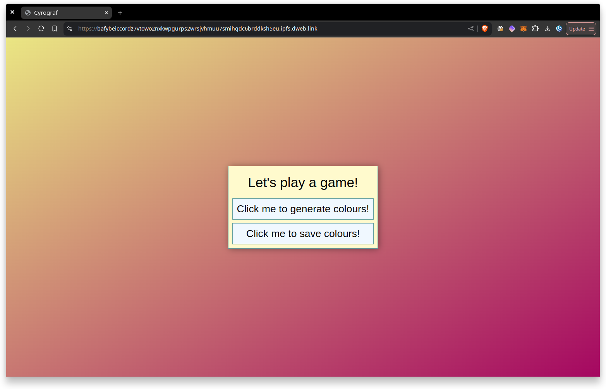
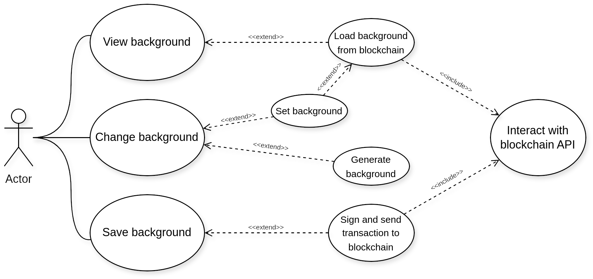
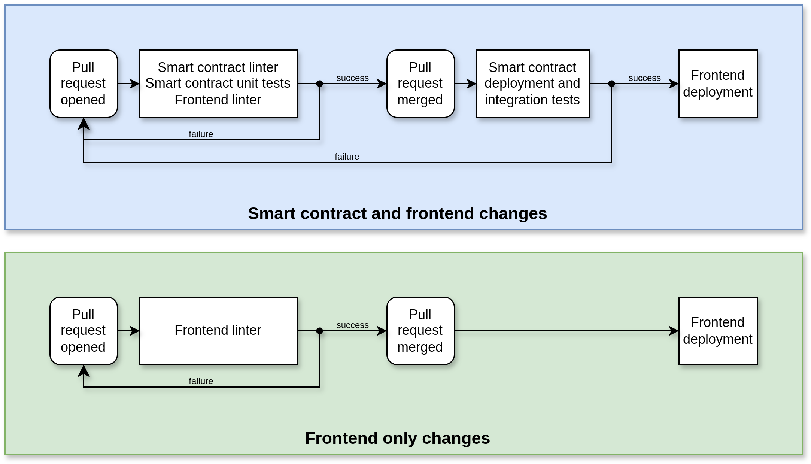

# cyrograf

This repository contains simple web3 application with automated CI/CD.

# Project structure

The repository consists of couple different parts divided into folders:
* `.github/workflows/` – definitions of CI/CD pipelines,
* `eth/` – smart contract for backend,
* `integration/` - current smart contract ABI and integration tests,
* `ui` – frontend of web3 app.

## Frontend

The frontend is build in pure HTML, CSS and JavaScript. It utilizes the [web3 library](https://docs.web3js.org/).

The following diagram presents the usage of application:

## Backend

The backend is basend on Ethereum's smart contract written in Solidity. There are also unit tests for contract.

The contract handles two requests:
* `getBackground()` – returns Background object which represent RGB values of two corners in the UI and wallet address of last setter,
* `setBackground()` – takes two tuples of RGB colour values and stores them in a ledger.

## CI/CD

The Continuous Integration and Continuous Testing is divided into couple of stages visualized in picture:

With each pull request merged with changes of smart contract the integration tests are performed and new PR with ABI update for frontend is automatically opened by github-bot.

### External links
Implemented CI/CD workflow is based on following pipelines:
* [HTML5 Validator Action](https://github.com/Cyb3r-Jak3/html5validator-action)
* [IPFS Pin & Publish](https://github.com/piotrjwegrzyn/ipfs-aio-publisher)
* [Action For Running Solidity Unit Tests](https://github.com/EthereumRemix/sol-test)
* [Slither Action](https://github.com/crytic/slither-action)
* [Deploy EVM smart contract](https://github.com/piotrjwegrzyn/evm-deployment)

# License

All software in this repository is published under GNU General Public License v3. See [LICENSE file](./LICENSE).